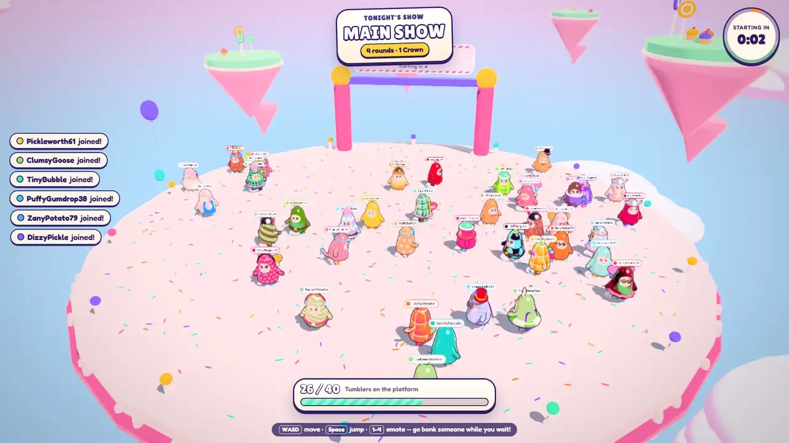
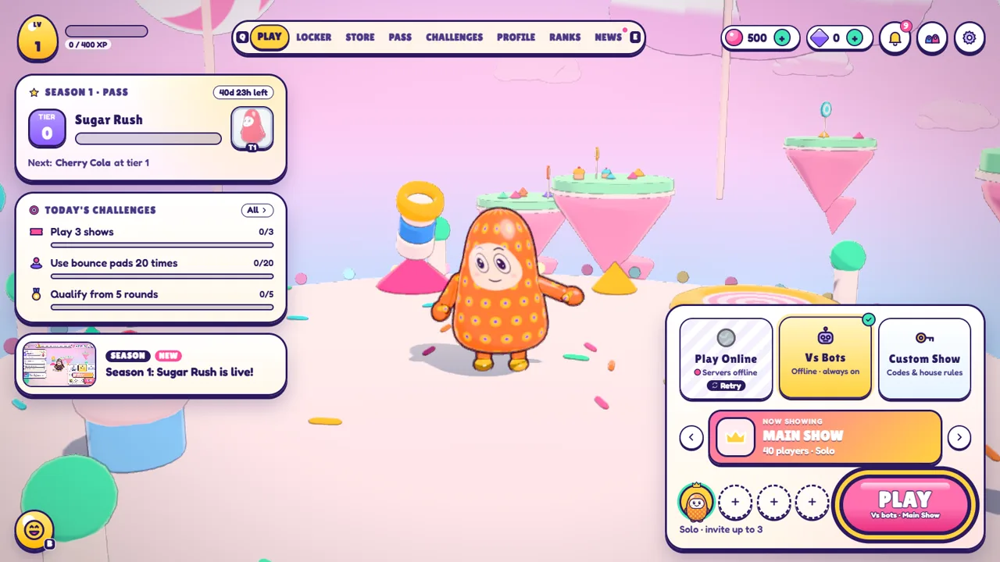
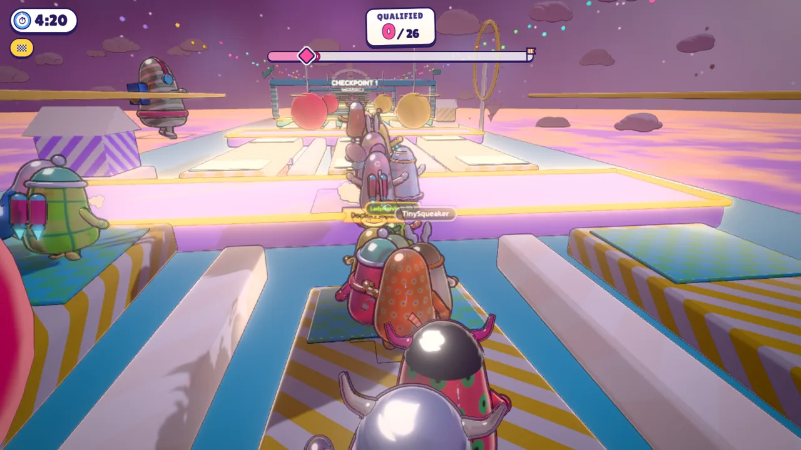
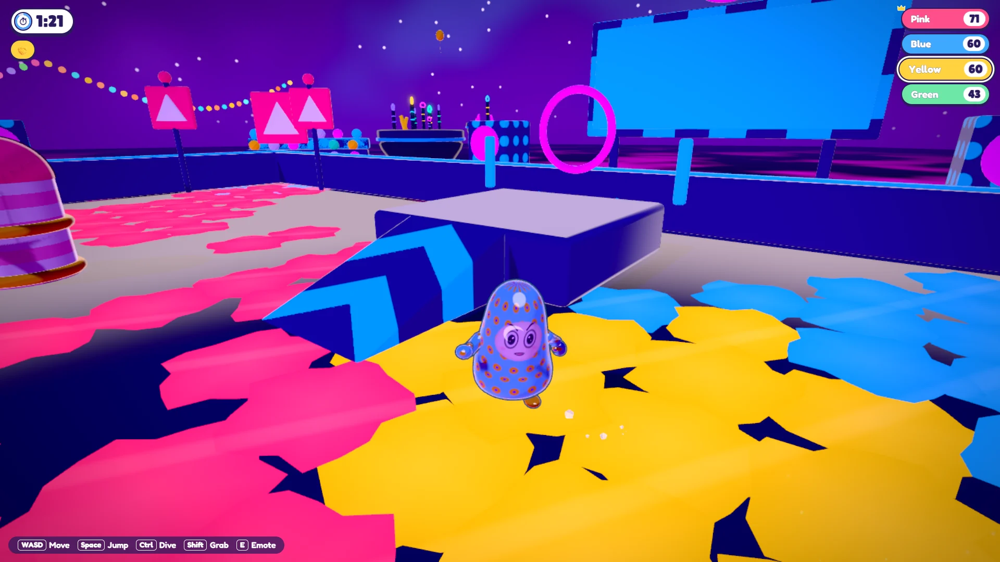
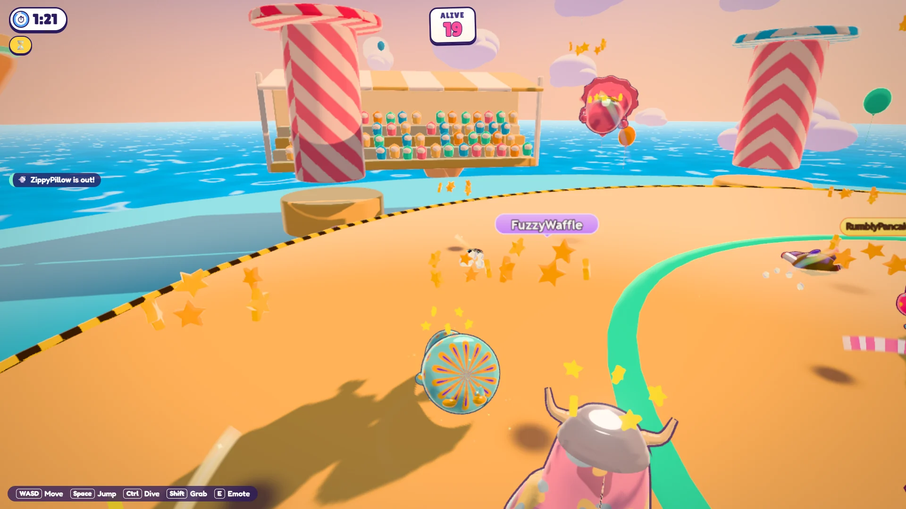
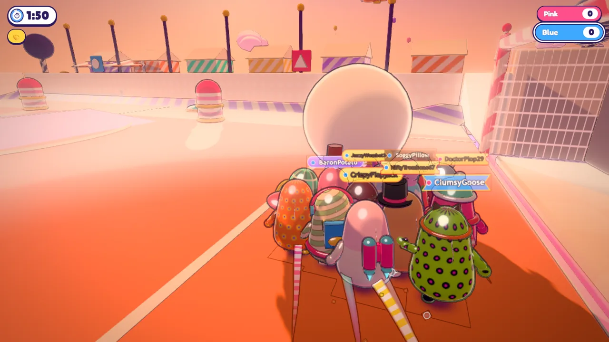
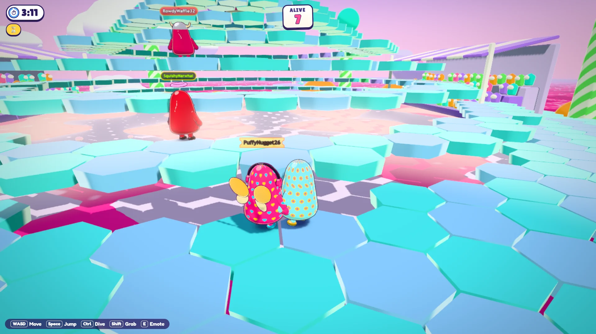
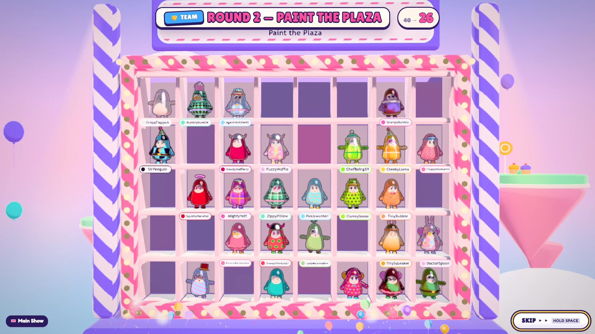
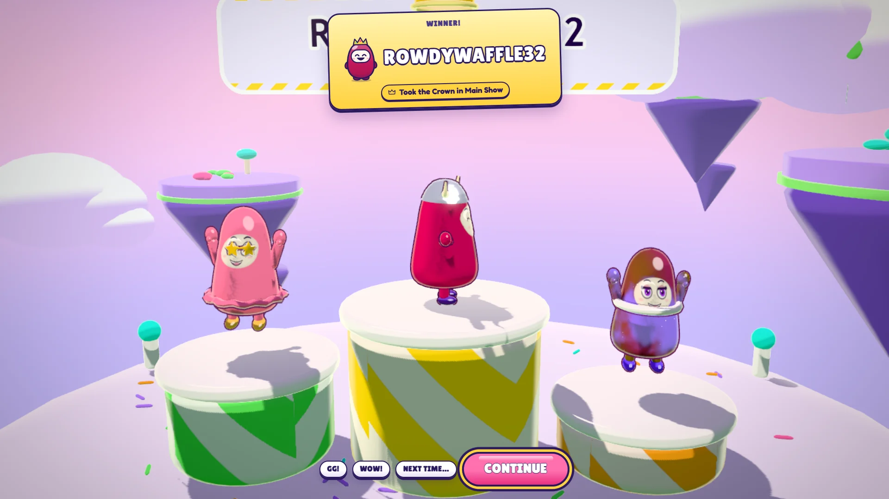
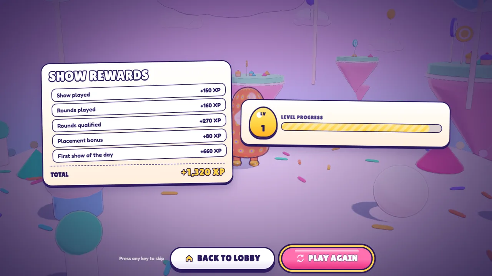

<div align="center">

# Tumble Royale

**A 100-player physics party royale that runs in a browser tab.**

[](LICENSE)




[Watch the full trailer (MP4)](docs/media/trailer.mp4)

</div>

Up to 100 Tumblers (humans and bots) compete through a show of 3–5 randomly
drawn rounds (races, survivals, team games, a logic round and a final) until
one player takes the Crown. No install, no plugins: it runs in a browser tab
on desktop and mobile.

<table>
  <tr>
    <td></td>
    <td></td>
    <td></td>
  </tr>
  <tr>
    <td></td>
    <td></td>
    <td></td>
  </tr>
  <tr>
    <td></td>
    <td></td>
    <td></td>
  </tr>
</table>

- **Rendering:** three.js `WebGPURenderer` with automatic WebGL2 fallback and TSL node materials
- **Physics:** Rapier (WASM), the same pinned build on client and server
- **Multiplayer:** server-authoritative 30 Hz rooms, binary delta snapshots, client prediction
- **UI:** React 19 + Zustand overlay on top of the canvas
- **Content:** 20 rounds plus a tutorial island, 36 obstacle types, 225 cosmetics, 10 themes, all procedural (zero external art assets)

What a player can do today:

- **Play:** solo, Duos and Squads online with parties, or any show offline
  against bots; Chaos Mode (one mutator per show), Ranked (solo rounds only,
  seasonal soft reset) and a gentler First Show for newcomers
- **Private shows:** invite codes, host-picked rounds and rules changed live,
  kick/ban, lock, transfer host, ready checks and spectator slots
- **Social:** friends (requests, presence, join), party and in-show text chat
  with a filter, quick pings, report / block / mute, streamer mode
- **Progression:** accounts (guest, Discord, Google, email link), seasons,
  a 100-tier pass, challenges, store, Crown Shard shop, free Gem paths, live
  news and notifications
- **Watch:** keep spectating after elimination, round replays (save and
  reopen them), photo mode
- **Input & access:** keyboard/mouse with rebinding, gamepad menus,
  single-layer touch controls, vibration, colour-blind palettes (also in 3D),
  captions and an opt-in spoken announcer

All characters, rounds, obstacles and cosmetics are original IP.

## Quick start

Requirements: Node 22+, pnpm 10 (`corepack enable`), a recent Chrome or Edge.

```sh
pnpm install
pnpm --filter @tumble/client dev        # http://localhost:5173
```

That is enough to play: the client runs full shows offline against 39 bots.
To play online against a local authoritative server, also start the game
server and add `?online=1`:

```sh
pnpm setup:env                          # once: writes .env files with local secrets
pnpm --filter @tumble/game-server dev   # ws://localhost:7350/ws
# open http://localhost:5173/?online=1
```

`pnpm dev` starts every app with a `dev` script in parallel: client, game
server, API and matchmaker.

### Services

| Service     | Package            | Port | Needed for                                                                                            |
| ----------- | ------------------ | ---- | ----------------------------------------------------------------------------------------------------- |
| Game client | `apps/client`      | 5173 | everything                                                                                            |
| Game server | `apps/game-server` | 7350 | online play                                                                                           |
| Account API | `apps/api`         | 7360 | accounts, inventory, store, pass, ranked, social (optional; the client falls back to a local profile) |
| Matchmaker  | `apps/matchmaker`  | 7370 | queues, parties, private shows                                                                        |

The API uses an embedded Postgres (PGlite) and in-memory Redis when
`DATABASE_URL` / `REDIS_URL` are unset, and a fake payment provider without
Stripe keys, so the whole stack runs locally with no external services.

### Environment

`pnpm setup:env` creates every `.env` from its `.env.example`, filling the
root file's secrets with random values; `pnpm dev` runs it automatically and
it never overwrites an existing `.env`.

| File                                                             | Holds                                                                                                    |
| ---------------------------------------------------------------- | -------------------------------------------------------------------------------------------------------- |
| [`.env.example`](.env.example)                                   | Secrets and URLs shared by the API, matchmaker and game server (`JWT_SECRET`, `INTERNAL_HMAC_SECRET`, …) |
| [`apps/api/.env.example`](apps/api/.env.example)                 | API overrides: database, Redis, OAuth, SMTP, Stripe, tuning                                              |
| [`apps/matchmaker/.env.example`](apps/matchmaker/.env.example)   | Matchmaker overrides: Redis, lobby timing, rate limits                                                   |
| [`apps/game-server/.env.example`](apps/game-server/.env.example) | Game server overrides: public URL, region, capacity, results outbox                                      |
| [`apps/client/.env.example`](apps/client/.env.example)           | Client build URLs (`VITE_*`, baked into the bundle) and the dev proxy target                             |

Each service loads its own `apps/<name>/.env`, then the root `.env`; real
environment variables always win. Secrets have no built-in defaults: a service
lists every missing or invalid variable and exits, and refuses the `change-me`
placeholders from the examples. Tests never read `.env` files.

### Deploying

Build the client with the addresses of your services; the defaults point at
the local dev stack:

```sh
VITE_API_URL=https://api.example.com \
VITE_MATCHMAKER_URL=https://mm.example.com \
VITE_GAME_SERVER_URL=wss://play.example.com/ws \
  pnpm --filter @tumble/client build      # static files in apps/client/dist
```

If `VITE_GAME_SERVER_URL` is unset, the client connects to `/gs/ws` on its
own origin, so a reverse proxy in front of the game server also works. Run the
servers with `NODE_ENV=production`, the four shared secrets set to the same
strong values on every service (see [SECURITY.md](SECURITY.md)) and
`REDIS_URL`: production requires matchmaker tickets to join a game and
disables Gem checkout unless Stripe is configured. The "Required in
production" group of each `.env.example` lists what to set.

The client is a single-page app. Party invites (`/join/<code>`), OAuth and
email sign-in returns (`/auth/*`) and Stripe returns (`/store`) must serve
`index.html`. The build includes `_redirects` (Netlify, Cloudflare Pages)
from `apps/client/public/`, and `apps/client/vercel.json` does the same on
Vercel; other hosts need equivalent rewrites.

### Client URL options

Two options work everywhere, so players can troubleshoot graphics:

| Param                            | Effect                                          |
| -------------------------------- | ----------------------------------------------- |
| `?backend=webgpu\|webgl`         | Force a GPU backend                             |
| `?tier=low\|medium\|high\|ultra` | Skip the GPU benchmark and force a quality tier |

The rest are developer tools. They work under `pnpm dev` and in sandbox
builds (`pnpm --filter @tumble/client build:sandbox`), and a normal
production build ignores them, since a crafted link could otherwise change
how the game runs or point the client at another server.

| Param                                       | Effect                                                            |
| ------------------------------------------- | ----------------------------------------------------------------- |
| `?online=1`                                 | Skip the mode select and play against the game server             |
| `?autoplay=1`                               | A bot drives your Tumbler and menus auto-advance (demos, e2e)     |
| `?shows=N`                                  | With autoplay: shows to start from the menu (0 = stop at menu)    |
| `?mm=0`                                     | Never matchmake; Play runs an offline show unless `?online=1`     |
| `?ts=N`                                     | Time scale (max 16)                                               |
| `?debug=1`                                  | Debug panel (skip round, force qualify, teleport) + stats overlay |
| `?playlist=<id>` / `?players=N` / `?seed=N` | Offline show overrides                                            |
| `?fresh=1`                                  | Ignore the saved profile (replays the first-launch flow)          |
| `?api=0` / `?apiUrl=` / `?mmUrl=` / `?gs=`  | Disable or redirect the API, matchmaker or game server            |
| `?scene=test`                               | Phase 0 renderer/physics test scene                               |

### Dev sandboxes

Every `apps/client/*.html` is its own Vite entry. `pnpm dev` serves them all
and `build:sandbox` builds them; a production build ships only the game.

| Page                     | What it shows                                                                          |
| ------------------------ | -------------------------------------------------------------------------------------- |
| `/playground.html`       | Tumbler controller test course with live tuning                                        |
| `/tumbler.html`          | Character showroom: animation states, emotes, cosmetics, ragdoll, 40-crowd stress test |
| `/obstacles.html`        | Every obstacle animating, with live param editing                                      |
| `/level.html?round=<id>` | Any round with bots racing it; flyover and follow cameras                              |
| `/world.html`            | Themes, weather, VFX, post-processing, and the menu, wall and podium scenes            |
| `/ui.html?screen=<id>`   | Every UI screen with mock data, plus an auto-played show                               |
| `/audio.html`            | Sound board: SFX, adaptive music, stingers, spatial demo                               |
| `/tutorial.html`         | Practice Island on its own, without the splash and menu flow                           |

## Repository layout

```
apps/
  client/        Vite app: composition root, game loop, input, net, dev sandboxes
  game-server/   Authoritative rooms (Rapier in Node), show flow, bots, metrics
  api/           Fastify + Drizzle: accounts, economy, pass, ranked, social
  matchmaker/    Queues, parties, private shows, server registry, join tickets
packages/
  shared/        Constants, math, seeded RNG, collision groups, round schema
  sim/           Headless simulation shared by server and client prediction
  content/       Data: rounds, playlists, cosmetics, themes, tuning, progression
  netcode/       Bit packing, snapshots, reliable channel, clock sync
  render/        Renderer, TSL materials, character, obstacles, levels, VFX, scenes
  audio/         Web Audio engine, procedural SFX, adaptive music, announcer
  ui/            React overlay: every screen, HUD and transition
tools/
  bot-swarm/     Headless WebSocket load tester
  media/         Turns e2e captures into the README trailer and stills (ffmpeg)
docs/
  SPEC.md        Product brief
  ARCHITECTURE.md  Package boundaries, contracts and team rules
  design/        Levels, screens, shows, art direction, audio direction
```

Dependencies flow one way: `shared ← sim ← content ← render / audio / netcode ← ui ← client`.
The `sim` package is the heart of the game: the server runs it
authoritatively and the client runs the same code to predict the local
player. Read [docs/ARCHITECTURE.md](docs/ARCHITECTURE.md) before changing a
package boundary or a shared contract, and [DECISIONS.md](DECISIONS.md) for
the reasoning behind non-obvious choices.

## Working on the code

```sh
pnpm typecheck                    # every package
pnpm test                         # every package's vitest suite
pnpm lint                         # eslint (also enforces sim determinism rules)
pnpm format:check
pnpm --filter @tumble/sim test    # one package
```

Browser tests use Playwright with the locally installed Edge (`PW_CHANNEL`
overrides the channel) and start the client and game server themselves:

```sh
cd apps/client
npx playwright test e2e/phase0.spec.ts                    # renderer parity + physics determinism
npx playwright test e2e/game.spec.ts                      # a full 100-player show, splash to rewards
ROUNDS=gumdrop-gauntlet,tile-panic npx playwright test e2e/level.spec.ts  # per-round smoke + screenshots
```

For long e2e runs while files are changing, point the specs at a private
preview of a sandbox build (`build:sandbox`, then `vite preview`) with
`GAME_URL=http://localhost:<port>` so hot reloads don't restart the page. The
specs rely on dev URL options, so a plain production build won't work.
CI runs the menu and phase 0 specs this way on every push to main; see
[CONTRIBUTING.md](CONTRIBUTING.md) for the exact commands.

Rules that keep the simulation deterministic (lint-enforced in `sim`,
`shared`, `netcode` and `content`): no DOM, no three.js, no `Date.now()`, no
`Math.random()`. Use the seeded `Rng` from `@tumble/shared` and match time.
Moving obstacles are pure functions of match time, so every machine computes
the same pose with zero bandwidth.

### Adding content

- **A round:** add `packages/content/src/rounds/<id>/index.ts` exporting
  `defineRound({...})`, register it in one of the `group-*.ts` lists, and
  preview it at `/level.html?round=<id>`. Obstacle params are validated
  against each module's zod schema; misspelt keys are stripped silently, so
  copy the round tests' "no stripped keys" check.
- **An obstacle:** add a sim module in `packages/sim/src/obstacles/` (schema,
  pure `pose(t)`, `create()`), a visual in `packages/render/src/obstacles/`,
  and register both in the set files. It appears in `/obstacles.html`
  automatically.
- **A cosmetic:** add it to `packages/content/src/cosmetics/catalog.ts`; the
  procedural mesh or pattern id it references lives in
  `packages/render/src/character/`.

## Status

| Area                        | State                                                                                                                                            |
| --------------------------- | ------------------------------------------------------------------------------------------------------------------------------------------------ |
| Foundations                 | Done: both GPU backends render, client/server Rapier bit-identical after 600 steps (`e2e/phase0.spec.ts`)                                        |
| The Tumbler                 | Done; tuning still needs human playtesting                                                                                                       |
| Netcode                     | Done: no steady-state corrections at 150 ms + 2% loss (unit-tested), lag-compensated grab/dive hit assist, protocol v5                           |
| Shows                       | Done: full shows end to end in the browser (`e2e/game.spec.ts`; 100-player run pending), solo/Duos/Squads online                                 |
| Meta & accounts             | Done: guest + OAuth/email accounts, locker, parties, matchmaking, server-granted rewards, seasons, shard shop                                    |
| Content                     | 20 rounds, tutorial island, procedural audio. Touch controls exist but no phone frame rate has been measured                                     |
| Ranked, store, pass, social | Done: OpenSkill ranked with soft reset, store, pass, challenges, friends, chat, private shows, moderation                                        |
| Launch hardening            | Partly: rate limits, bans, reconnect, results outbox, metrics. Not done: long soak, load test against a deployed stack, crash reporting, hosting |

Server tick time is measured, not asserted in CI. A full 100-player room
(real sim, director and snapshot encoders, 100 protocol clients, Tilt Town,
60 s of PLAYING) costs **6.4 ms p50 / 9.0 ms p95 / 26.8 ms max** per 30 Hz
tick (sim 4.1 + snapshots 2.4 + send 0.1 ms mean) and sends **33.9 KB/s**
of snapshots per client; one human with 99 bots costs 8.1 ms p95. Hence
`MAX_ROOMS=3` per process (one event loop per core). Reproduce in process
with `TUMBLE_PERF=1 pnpm --filter @tumble/game-server exec vitest run test/tickBudget.test.ts`,
or over real sockets: start the game server and run
`pnpm --filter @tumble/bot-swarm start -- --clients 100 --duration 60`, which
prints the server's `/metrics` including `tumble_tick_ms` avg / p95 / max.
Results depend on the machine.

Production still needs hosting for the client and the four services, a
Postgres database (without `DATABASE_URL` the API uses an embedded PGlite
file), and Redis (required by the API and matchmaker in production;
`ALLOW_MEMORY_STORE=1` runs a single instance without it). Discord/Google
OAuth, Stripe and SMTP are optional: without them those sign-in methods and
Gem checkout are simply off.
